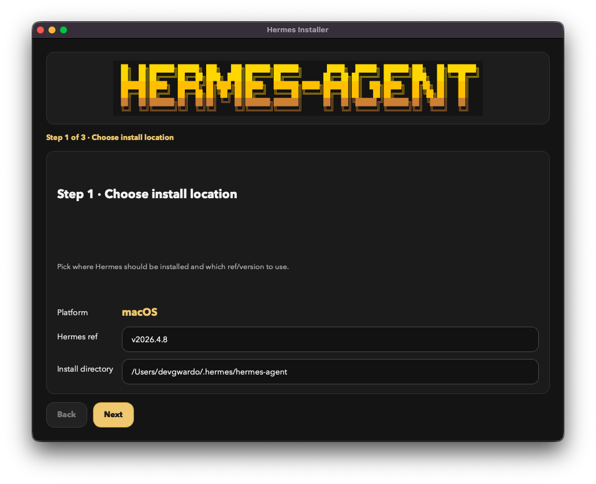

<p align="center">
  
</p>

<h1 align="center">Hermes Installer</h1>

<p align="center">
  <strong>One-click desktop installer for <a href="https://github.com/NousResearch/hermes-agent">Hermes Agent</a></strong>
</p>

<p align="center">
  <a href="https://devvgwardo.github.io/hermes-installer/">
    
  </a>
</p>

<p align="center">
  
  
  
  
  
  
</p>

---

<p align="center">
  <a href="https://devvgwardo.github.io/hermes-installer/">
    
  </a>
  &nbsp;
  <a href="https://devvgwardo.github.io/hermes-installer/">
    
  </a>
</p>

---



## ✨ Features

| Feature | Description |
|---------|-------------|
| 🚀 **One-Click Install** | Download, open, click <kbd>Install Hermes</kbd> — done |
| 📦 **Latest Stable by Default** | Resolves the latest Hermes release from GitHub automatically |
| 📜 **Streaming Logs** | Watch installation progress in real-time inside the app |
| ⚙️ **Custom Installs** | Choose your install directory or specify a custom version/ref |
| 🔄 **Auto Setup** | Opens `hermes setup` after install for provider, OAuth & model config |
| 🔒 **Official Scripts** | Calls upstream install scripts directly — no forks, no reimplementations |
| 💻 **Native Desktop** | Builds native `.app` (macOS) and `.exe` (Windows) in CI |

## 📥 Download

| Platform | File | Requirements |
|----------|------|-------------|
| macOS | [`Hermes-Installer-macOS.zip`][macOS] | macOS 11 (Big Sur) or later |
| Windows | [`Hermes-Installer-Windows.exe`][Windows] | Windows 10/11 (64-bit) |

[macOS]: https://github.com/DevvGwardo/hermes-installer/releases/latest/download/Hermes-Installer-macOS.zip
[Windows]: https://github.com/DevvGwardo/hermes-installer/releases/latest/download/Hermes-Installer-Windows.exe

> **Checksums** — Verify downloads with [`SHA256SUMS.txt`](https://github.com/DevvGwardo/hermes-installer/releases/latest/download/SHA256SUMS.txt)

## 🛠 Quick Start

1. **Download** the installer for your platform from the table above or the [latest release][releases]
2. **Open** the app — on macOS you may need to right-click → Open the first time
3. **Click** <kbd>Install Hermes</kbd> and follow the prompts

[releases]: https://github.com/DevvGwardo/hermes-installer/releases/latest

That's it. The installer pulls the official Hermes install script from [`NousResearch/hermes-agent`](https://github.com/NousResearch/hermes-agent) and sets everything up.

## 🧑‍💻 Local Development

```bash
python3 -m venv .venv
source .venv/bin/activate
python -m pip install --upgrade pip
python -m pip install -e ".[dev]"

# Run tests
pytest

# Preview the install plan
python -m hermes_installer.cli plan

# Launch the GUI
python -m hermes_installer.app
```

## 🔨 Build Locally

**macOS:**

```bash
./scripts/build_macos.sh
```

**macOS (signed & notarized):**

```bash
# Set the required Apple signing env vars first
./scripts/sign_and_notarize_macos.sh
```

**Windows:**

```powershell
./scripts/build_windows.ps1
```

## 📁 Repo Layout

```
hermes_installer/     → Application code (PySide6 GUI + CLI)
tests/                → Unit tests for platform & command generation
scripts/              → Local build helpers (macOS / Windows)
site/                 → Static download page (GitHub Pages)
.github/workflows/    → CI, release & Pages automation
```

## 📦 Release Artifacts

The [`release.yml`][workflow] workflow produces:

| Artifact | Description |
|----------|-------------|
| `Hermes-Installer-macOS.zip` | Signed & notarized macOS app bundle |
| `Hermes-Installer-Windows.exe` | Standalone Windows executable |
| `SHA256SUMS.txt` | Integrity checksums for all artifacts |

[workflow]: ./.github/workflows/release.yml

## 🍎 macOS Signing & Notarization

Unsigned macOS builds trigger a Gatekeeper warning. To ship a clean build, configure these **GitHub Actions secrets**:

| Secret | Description |
|--------|-------------|
| `APPLE_DEVELOPER_ID_APP` | e.g. `Developer ID Application: Your Name (TEAMID)` |
| `APPLE_DEVELOPER_ID_APP_CERT_P12_BASE64` | Base64-encoded `.p12` certificate export |
| `APPLE_DEVELOPER_ID_APP_CERT_PASSWORD` | Password for the `.p12` |
| `APPLE_NOTARY_APPLE_ID` | Apple ID email for notarization |
| `APPLE_NOTARY_TEAM_ID` | Apple Developer Team ID |
| `APPLE_NOTARY_APP_PASSWORD` | App-specific password for notary submission |

Once configured, tagged releases will automatically sign, notarize, staple, and upload the macOS build.

## 🚢 Publishing

1. Push the repo to GitHub
2. Create a release tag (e.g. `v0.1.0`)
3. The [`release.yml`][workflow] workflow builds and attaches artifacts
4. Enable **GitHub Pages** using the Actions workflow
5. For trusted macOS downloads, set the Apple signing secrets **before** tagging

## ⚠️ Notes

- This is a **UI wrapper** around upstream Hermes install scripts — not a fork of Hermes itself
- Defaults to the **latest stable** Hermes release; falls back to `main` if GitHub API resolution fails
- Hermes stays upstream at [`NousResearch/hermes-agent`](https://github.com/NousResearch/hermes-agent)
- Without Apple signing credentials, macOS builds **will not pass Gatekeeper**

## 📄 License

This project is licensed under the [MIT License](LICENSE).

<p align="center">
  <a href="https://github.com/NousResearch/hermes-agent">
    
  </a>
</p>